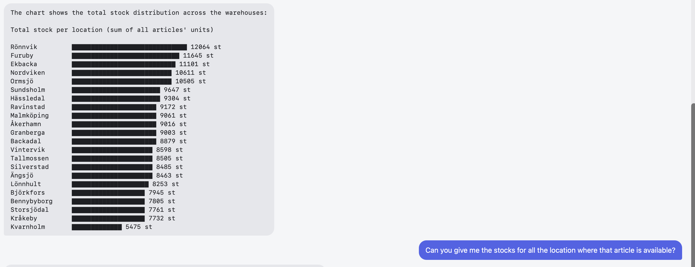

# Local Agent

A fully offline coding and inventory assistant, built around a local LLM (via [Ollama](https://ollama.com)) and a RAG pipeline over a project's own files. No API keys, no cloud calls, no data leaves the machine.

`#LocalLLM` `#RAG` `#RAGPipeline` `#Ollama` `#Qwen` `#AppliedAI` `#MachineLearning` `#AIAgent` `#AgenticAI` `#OfflineAI` `#ToolCalling` `#FunctionCalling` `#VectorSearch` `#SemanticSearch` `#PromptEngineering` `#EdgeAI` `#OnDeviceAI` `#MLEngineer` `#AIEngineer` `#SoftwareEngineer` `#DataScience` `#Portfolio` `#BuildInPublic`

The demo scenario is a simulated wholesale warehouse (`lager.dat`), built to resemble the fixed-width, COBOL-era inventory systems still common in that industry — a realistic example of adding an AI assistant on top of that kind of legacy data without touching the underlying system.

> **Note:** `lager.dat` is synthetic, randomly generated data. It is not real inventory data from any company.



## What it does

- **Answers questions about this project's own code**, grounded in the actual source via semantic search (RAG) — not guesses from the model's training data.
- **Answers questions about the warehouse data**: stock totals, lowest/highest stock, per-location breakdowns, article lookups, a text-based bar chart of stock distribution.
- **Proposes code changes as diffs**, not full file rewrites — a human reviews and applies them.
- Runs as a **terminal app**, a **web UI** (mobile-friendly, bilingual SV/EN), or in **Docker**.

## Architecture

```
┌─────────────┐      ┌──────────────────┐      ┌─────────────────┐
│  Terminal /  │─────▶│   Agent (Python)  │─────▶│  Ollama (local)  │
│  Web UI      │◀─────│  tool-calling loop │◀─────│  qwen2.5-coder   │
└─────────────┘      └─────────┬─────────┘      └─────────────────┘
                                │
                      ┌─────────┴─────────┐
                      │   ChromaDB index   │  (code chunked per function/class
                      │  (nomic-embed-text)│   via Python's ast module)
                      └───────────────────┘
```

The model never edits files or runs arbitrary code. It can only call a fixed set of read-only tools, implemented in plain Python and reviewed, not generated:

**Code tools** (available in any project the agent is pointed at):
- `read_file`, `grep`, `search_code` — explore the codebase (semantic search is the RAG part)
- `propose_edit` — suggest a change as a diff, never applied automatically

**Inventory tools** (built for this warehouse use case, as an example of domain-specific tools):
- `find_max_stock` / `find_min_stock` — highest/lowest total stock, optionally filtered by location
- `list_stock_by_location` — per-location breakdown for one article
- `list_locations` — every distinct warehouse location
- `stock_distribution_chart` — a text-based bar chart of total stock per location

## Quick start

See [RUN.md](RUN.md) for exact commands (local and Docker, with troubleshooting). In short:

```bash
# Local
agent index /path/to/project
agent chat /path/to/project

# Web UI
uvicorn agent.server:app --port 8000
# open http://localhost:8000

# Docker
docker compose build
docker compose run --rm agent
```

Requires [Ollama](https://ollama.com) running locally with at least one `qwen2.5-coder` model pulled.

## Tech stack

- **Python**, [Click](https://click.palletsprojects.com/) (CLI), [Rich](https://github.com/Textualize/rich) (terminal UI)
- **Ollama** — local inference (`qwen2.5-coder:7b` / `14b`, tested against `qwen3.8:27b`)
- **ChromaDB** + `nomic-embed-text` — the RAG index
- **FastAPI** + **Uvicorn** — the web backend
- **Docker** / Docker Compose — containerized deployment
- **pytest** — 46 tests covering chunking, indexing, tools, and the agent loop

## Model choice

Three models were tried: `qwen2.5-coder:7b`, `qwen2.5-coder:14b`, and `qwen3.8:27b-q4_K_M`. `14b` gave the best balance of answer quality and speed for this agent's multi-step tool-calling workflow, and is the default. `27b` is large relative to this machine's 24 GB unified memory, which made it noticeably heavier to run, and it also hit a separate, confirmed bug: intermittent tool-calling failures (`no user query found`, see below) traced to Ollama's own support for that model — not a memory issue, which was specifically tested and ruled out.

## Hardware

Developed and run on a **MacBook Air, Apple M5, 24 GB unified memory**. All models were run through Ollama's Metal (GPU) backend on-device — nothing was offloaded to a cloud GPU at any point. This is also roughly the practical ceiling for this machine: `qwen3.8:27b-q4_K_M` (~17 GB) runs, but leaves little headroom for anything else running at the same time, which is part of why `14b` (~9 GB) is the default.

## Known limitations

This is a learning project, and it's documented honestly rather than oversold:

- **Local 7B/14B models are not fully reliable tool-callers.** Even after repeated system-prompt reinforcement, the model sometimes still asks the user to run a tool instead of calling it itself, or writes code suggestions without actually reading the real source first. This was measured and iterated on, not assumed away.
- **`grep` is plain substring matching, not regex** — the model occasionally assumes it supports regex syntax and gets confused when it doesn't match.
- **Self-diagnosis is weak.** Asked "what tools do you have," the model has under-reported its own tool list even while using the missing tools in the same answer.
- **`qwen3.8:27b` intermittently fails** on tool-call turns with a `no user query found` error. Root cause traced to Ollama's tool-calling support for that model, not this codebase; documented as a known external limitation rather than chased indefinitely.
- **No persistent conversation memory.** The web UI keeps history per session in memory; it's lost on server restart. No long-term memory/retrieval across sessions yet.
- **Single global model setting.** The web server's model selector changes a process-wide setting, so concurrent users picking different models would currently interfere with each other.

## Project layout

```
src/agent/        the agent itself (CLI, web server, RAG, tools, agent loop)
tests/            pytest suite
web/               the web UI
Dockerfile, docker-compose.yml, .dockerignore
RUN.md            exact commands to run it, both locally and in Docker
Dagbok.md / Diary.md   build diary (Swedish / English)
```

## Why this project

Built as a hands-on way to learn how local LLM agents, RAG pipelines, and tool-calling actually work under the hood, and as portfolio material for freelance/consulting work. The broader goal behind it: helping businesses grow in creative ways by adding AI as a practical tool in their own operations.

The warehouse scenario here is one concrete illustration of that, not the limit of it. It simulates how a wholesale/logistics company could use a local AI assistant against its own inventory data, without any data leaving the company's own machines. The underlying architecture — a RAG index over a project's own files, a tool-calling agent, and a system prompt — isn't specific to warehouses. Point it at a different set of files, build a different set of tools and a different system prompt, and the same agent could just as well serve, for example, a law firm searching its own case files. This project demonstrates the pattern; it isn't a limit on where it applies.
